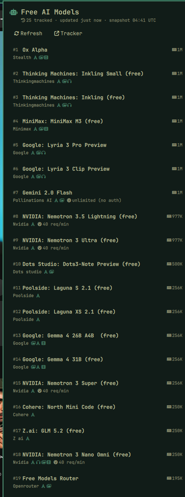

# Free AI Models

Omarchy bar widget tracking every currently-free AI model from the
[ClawLabsAI/free-ai-models](https://github.com/ClawLabsAI/free-ai-models)
daily tracker.

The bar shows a robot pill with the live count. Clicking it opens a panel
listing each model with provider, context window, modalities, and rate limit.
Data is fetched once by a shared service singleton, cached to
`~/.local/state/omarchy/free-ai-models-cache.json`, and refreshed every 6
hours (the upstream tracker updates daily).



## Install

```sh
omarchy plugin add https://github.com/ArgusGuardian/omarchy-freemodels.git --enable
```

Or drop this folder into `~/.config/omarchy/plugins/` and run:

```sh
omarchy-shell shell rescanPlugins
omarchy bar move io.github.argusguardian.freemodels --section center
```

## Usage

- **Left-click** the pill: open/close the model list panel
- **Middle-click**: force a data refresh
- **Right-click**: notification with today's top-ranked free model
- In the panel: **left-click** a row opens the provider page,
  **right-click** copies the model id (e.g. for use in API calls),
  `R` or the Refresh button refetches

## IPC

```sh
omarchy-shell io.github.argusguardian.freemodels status    # JSON status
omarchy-shell io.github.argusguardian.freemodels refresh   # force refresh
```

## Dependencies

- `curl` (fetch), `wl-copy` (copy model id), `xdg-open` (links) — all present
  on a stock Omarchy install. No API keys; only public endpoints.

## Security notes

- Network responses are hard-capped at 256 KB (`curl --max-filesize` plus a
  `head -c` truncation with `pipefail`), so the long-lived shell never
  buffers more than the cap; HTTPS-only via `--proto =https`.
- The cache file at `~/.local/state/omarchy/free-ai-models-cache.json` is
  read through a guard: regular file only (symlinks/FIFOs rejected), owner
  must match the effective uid, size capped at 256 KB, re-verified on the
  open descriptor (`/proc/self/fd`) to close the stat/open race, and the
  whole read runs under `timeout 2` so it can never stall the shell.
- The `FileView` handle used for cache writes is declared `preload: false`.
  Quickshell preloads its target path by default, which would read the
  predictable cache file into the long-lived shell outside the guard, so it
  is kept strictly write-only and never loads the path. All bytes entering
  shell memory come from one of the two audited paths above.
- All service-rendered strings are plain-text only (`textFormat:
  Text.PlainText`) and pass an ingest-time sanitizer, so a hostile tracker
  entry cannot flip QML's rich-text heuristic (no HTML rendering, no
  ``-driven remote fetches from labels).
- Rows are capped at 200 on both the network and cache paths, and cached
  entries re-run the exact same normalization/type-check contract as fresh
  fetches before anything reaches the UI.
- Click targets are restricted to http(s) URLs; `xdg-open` never receives
  tracker-controlled `file://` or custom application URI schemes.
- Writes use atomic rename (`FileView` `atomicWrites`). No elevated
  permissions anywhere.

## Remove

```sh
omarchy plugin remove io.github.argusguardian.freemodels
```
